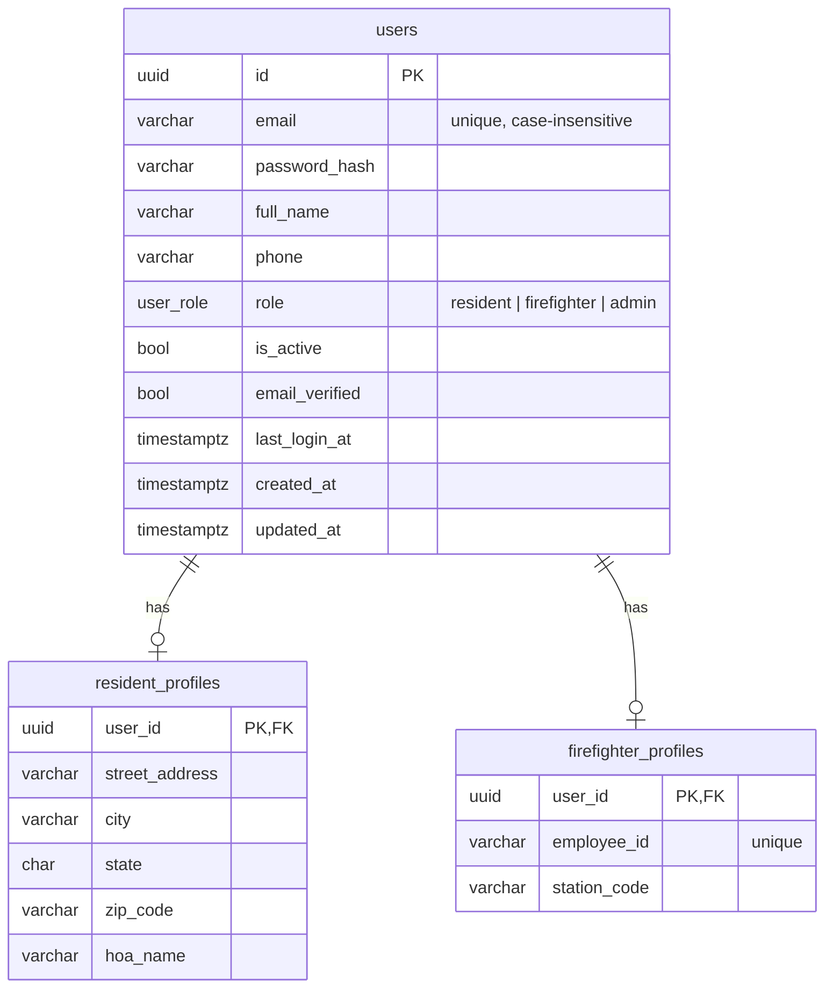

# Database

PostgreSQL 16 with PostGIS 3.4, accessed through SQLAlchemy 2 and migrated with Alembic.

## Local setup

```bash
docker compose up -d db          # from repo root
cd backend
cp .env.example .env
uv sync --extra dev
uv run alembic upgrade head
uv run pytest                    # db tests skip if postgres is down
```

| Setting | Value |
| --- | --- |
| host / port | localhost / 5432 |
| database | `fire_hazard_veg` (tests: `fire_hazard_veg_test`) |
| user / password | `fhv` / `fhv_dev_pw` (local only) |

Health check: `GET /api/v1/health/db`

Reset: `docker compose down -v && docker compose up -d db`

## Schema



Profiles are deleted with their user. Admins have no profile.

## Migrations

| Revision | Change |
| --- | --- |
| `0001` | enable `postgis`, `pgcrypto` |
| `0002` | `users`, `resident_profiles`, `firefighter_profiles` |

New migration: `uv run alembic revision --autogenerate -m "message"`
